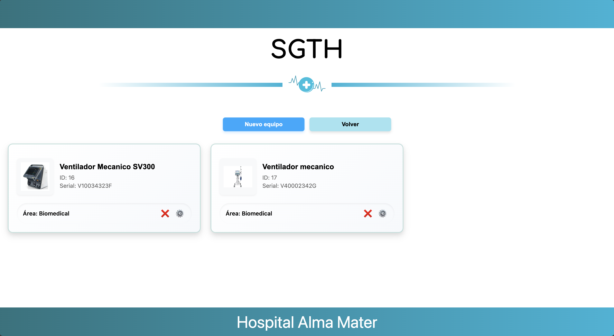

# Hospital Technology Management System

(SGTH)

📋 **Table of Contents**

- Overview
- Features
- Tech Stack
- Project Structure
- Getting Started

## Overview

The Hospital Technology Management System (SGTH) is a web-based platform designed to efficiently manage the inventory
and allocation of hospital equipment. The system supports healthcare institutions by enabling the registration, tracking
and maintenance of technological assets in various departments, ensuring smooth and efficient operation.

## Features

The first page is a home view where you can select the option about information of professionals or equipments


### 1. Equipment Management

✅ Register new equipment with required field validations  
✅ Categorize equipment by area (e.g., Biomedical, Infrastructure, IT)  
✅ Assign responsible personnel for each piece of equipment  


### 2. Inventory Overview

🔍 View a complete list of registered equipment  
📝 Detailed information for each item with `View More` and `Delete` options  
🔄 Filter and search equipment by area or category  


### 3. Professionals Management

✅ Register new professionals with required field validations  
✅ the information required to register a professional is:

- ID (numbers only)
- Name
- Last name
- Email (valid emails only)


### 4. Overview of the professionals

🔍 View a complete list of registered professionals  
📝 You can see `Delete` or `update` options, for management of the professionals
🔄 Filter and search equipment by area or category  


## 🛠 Tech Stack

### Frontend

🎨 Vue.js  
🎠 JavaScript

### Backend

🚀 Django
📚 Python 3.12

### Database

📦 MySQL

### Development Tools

📝 Visual Studio Code  
🐙 Git & GitHub

### Additional Libraries & Tools

📡 Axios for HTTP requests  
🚦 ESLint for code quality checks

### Project Structure


## 🚀 Getting Started

### Prerequisites

- Django 5.0.0 or higher
- MySQL 8.0.0 or higher
- Python 3.12.0

### Installation Steps

1. **Clone the repository**:
    ```bash
    git clone https://github.com/imEag/SGTH-Web-App.git
    ```

2. **Run the frontend**:
    ```bash
    cd frontend/
    npm install
    npm run dev
    ```

3. **Create a database in MySQL**:
   In my SQL create a database using this comand:
    ```bash
    CREATE DATABASE SGTH
    ```

4. **In backend folder**:
   Create a new file named `.env` in the backend folder with the following content:
    ```bash
    DB_USER=root
    DB_PASSWORD=
    DB_NAME=SGTH
    DB_PORT=3306
    DB_HOST=localhost
    ```
   Replace the placeholder values with your actual database credentials.


5. **Run the backend in a new terminal window**:
    ```bash
    cd .\backend\
    source venv/bin/activate
    pip install -r requirements.txt
    python manage.py makemigrations
    python manage.py migrate
    python manage.py runserver
    ```
6. **(Optional) Seed the database with sample data**:
   In the /backend/seeds folder you will find two .csv files, one for professionals and one for equipment. You can use
   them from your MySQL Workbench or any other tool to import the data to the database.

